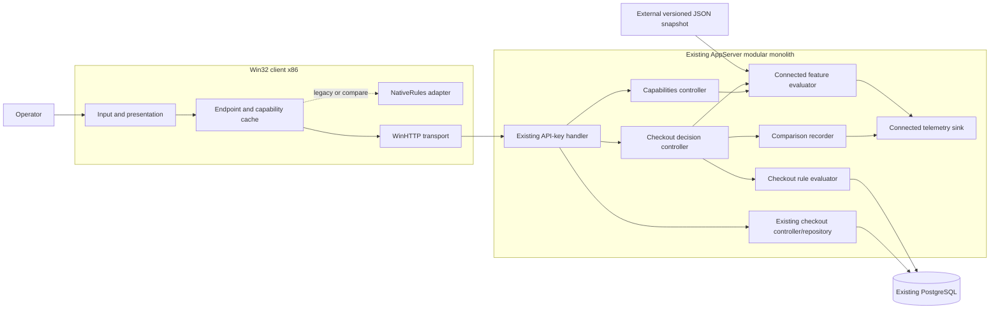

# Design Document: Service-Owned Client Business Rules

## Overview

This design moves checkout eligibility, tier checkout limits, and maximum-loan-duration decisions from the active Win32 service-mode path into the existing .NET Framework application service. It introduces no new deployable service and does not move workflow data or locked transaction rules out of PostgreSQL.

The migration is controlled by service-authoritative `connected.enabled` and `connected.checkout.rule-mode`. The Legacy path remains available when the parent is false or evaluation is unsafe. Compare mode observes a structured native result and a service result but retains the native result for operator flow and performs at most one checkout command. Service mode uses only the service decision for eligibility; PostgreSQL still revalidates the command under existing locks.

The design follows the approved requirements and the brownfield boundaries documented in [.sdd/knowledge/architecture/runtime-components.md](.sdd/knowledge/architecture/runtime-components.md), [.sdd/knowledge/architecture/connected-feature-gating.md](.sdd/knowledge/architecture/connected-feature-gating.md), and [.sdd/knowledge/data/ownership.md](.sdd/knowledge/data/ownership.md).

### Key Design Decisions

1. **Existing modular monolith:** add internal contracts and modules to `AppServer`; do not add a deployable service.
2. **Provider-neutral snapshot evaluator:** define `IConnectedFeatureSnapshotSource` and ship a POC `JsonFileFeatureSnapshotSource`. No external provider call occurs per operation. A future SDK adapter can replace the file source.
3. **Safe defaults:** parent missing/false/invalid/expired/source-error yields disabled. A child missing/invalid/expired yields `legacy`. Security controls do not consult flags.
4. **Explicit capability contract:** add authenticated `GET /api/v1/capabilities` with schema/version/freshness metadata. It is routing information, not authorization.
5. **Explicit decision contract:** add authenticated `POST /api/v1/checkout-decisions`. It is read-only and re-evaluates flags server-side so a stale or tampered client capability cannot elevate mode.
6. **Structured Legacy observation:** extend `NativeRules.dll` with a stable eligibility-reason export. In compare mode the client submits only the normalized native decision/reason; the service calculates and records the service decision. In service mode the client does not call NativeRules.
7. **PostgreSQL remains authoritative:** decision evaluation never writes. The existing idempotent `/api/v1/checkouts` path and `checkout_tool` routine remain the sole command/write path.
8. **Two endpoint roles:** preserve the Legacy base URL and add an externally configured Connected HTTPS URL used only for capability bootstrap until the parent enables Connected routing. Failure selects Legacy. This bootstrap probe is minimum flag plumbing permitted by policy.
9. **Bounded caching:** service snapshot refresh defaults to 30 seconds, maximum snapshot age to 5 minutes, and capability response lifetime to 30 seconds; all are external configuration with validated upper/lower bounds. A valid rollback converges within one 30-second refresh interval.
10. **Non-authoritative telemetry seam:** `IConnectedTelemetrySink` emits structured evaluation/comparison records. The POC sink writes structured JSON to the existing process diagnostic stream; tests use an in-memory sink. No application database table is added.
11. **Incremental delivery:** implement parent plumbing disabled by default, then service rules, compare mode, secure client routing, and finally service mode. Code deployment alone never activates migration.

## Architecture



### Component Interaction Flow

#### Capability bootstrap and endpoint selection

1. The client loads external Legacy and Connected endpoint configuration. The Legacy default remains `http://localhost:8088/`; Connected execution requires an explicit `https://` endpoint.
2. If no Connected endpoint is configured, the client uses Legacy behavior without probing.
3. If configured, the client calls `GET /api/v1/capabilities` on the Connected endpoint with normal authentication, TLS chain/hostname validation, and explicit timeouts.
4. The service refreshes or reads its cached snapshot, evaluates the parent and checkout child, emits evaluation evidence, and returns a versioned capability.
5. The client accepts only a supported, unexpired response. Any network, authentication, parsing, version, or freshness failure selects Legacy routing.
6. When the service reports parent disabled or checkout mode legacy, business calls continue to the Legacy endpoint and existing NativeRules path.
7. When compare or service is effective, affected reads/decisions/commands use the Connected endpoint. The capability is cached only through its `expiresAt` time.

#### Legacy mode

1. The current client input checks and confirmation remain.
2. The client loads member context and calls the NativeRules adapter.
3. A native denial blocks checkout with the Legacy message; an allow proceeds to the existing idempotent command.
4. No new decision endpoint or Connected telemetry is required for the workflow.

#### Compare mode

1. The client performs syntactic validation and obtains a structured native observation: `allowed` plus stable native reason.
2. The client posts the checkout decision input and native observation to `POST /api/v1/checkout-decisions` using the Connected endpoint.
3. The service re-evaluates flags. If compare is no longer effective, it returns the current safe effective mode and does not compare.
4. In compare mode, the service loads authoritative read context, evaluates the service rule, normalizes both observations, and emits one comparison record.
5. The response's effective decision is the native observation. A denial stops before confirmation; an allow proceeds after confirmation to one existing checkout command with one idempotency key.
6. A service decision failure records a comparison error but does not replace the Legacy decision or trigger another write.

#### Service mode

1. The client performs only syntactic validation and does not call NativeRules or derive eligibility from member DTO fields.
2. The client posts decision input without a native observation.
3. The service re-evaluates flags and calculates the service decision from repository read context.
4. A denial is presented using a stable reason mapping. An allow permits confirmation and the existing idempotent checkout command.
5. PostgreSQL revalidates all rules; a race can therefore turn a positive decision into a stable command conflict without corrupting state.

#### Rollback

1. Operations set child mode to `legacy` or parent to false in the external snapshot.
2. The service accepts an atomically replaced, valid snapshot on the next refresh; invalid intermediate content disables the parent.
3. Capability responses immediately reflect the current cached evaluation and never extend beyond 30 seconds.
4. Clients expire their capability and return to the NativeRules/Legacy endpoint path without deployment or data migration.

## Components and Interfaces

### AppServer feature evaluation module

New internal types, kept in the existing AppServer project:

```csharp
internal interface IConnectedFeatureSnapshotSource
{
    FeatureSnapshotLoadResult Load(DateTimeOffset now);
}

internal interface IConnectedFeatureEvaluator
{
    ConnectedCapability Evaluate(FeatureEvaluationContext context, Guid correlationId);
}

internal sealed class FeatureEvaluationContext
{
    public string Environment;
    public string PracticeKey;
    public string DeploymentRing;
    public string ClientVersion;
}
```

`JsonFileFeatureSnapshotSource` reads the path configured as `ConnectedFeatureSnapshotPath`. The file is external to source control. Reads use shared-read access, parse into an immutable candidate, validate the entire document, then atomically replace the in-memory snapshot. A failed refresh never promotes partially parsed content. Parent evaluation still resolves false whenever the source result is invalid, expired, or unavailable; it does not use an expired last-known true value.

Configuration:

| Key | Default | Bounds/behavior |
| --- | --- | --- |
| `ConnectedFeatureSnapshotPath` | empty | Empty means parent disabled. |
| `ConnectedFeatureRefreshSeconds` | 30 | 5–300 seconds. |
| `ConnectedFeatureMaxAgeSeconds` | 300 | 30–3600 seconds. |
| `ConnectedCapabilityLifetimeSeconds` | 30 | 5 seconds through refresh interval. |
| `ConnectedEnvironment` | `local` | Non-sensitive cohort attribute. |
| `ConnectedPracticeKey` | empty | Deployment-owned opaque identifier; never trust client input. |
| `ConnectedDeploymentRing` | `default` | Non-sensitive configured cohort. |

The evaluator computes:

```text
parent = valid && fresh && snapshot.connected.enabled && parentTargetMatches
mode = parent ? validatedTargetedChildMode : legacy
```

Reasons are stable enum-like codes: `PARENT_DISABLED`, `SNAPSHOT_MISSING`, `SNAPSHOT_INVALID`, `SNAPSHOT_EXPIRED`, `SOURCE_ERROR`, `PARENT_TARGET_MISS`, `CHILD_MISSING`, `CHILD_INVALID`, `CHILD_TARGET_MISS`, `LEGACY`, `COMPARE`, and `SERVICE`.

### Snapshot schema

```json
{
  "schemaVersion": 1,
  "configurationVersion": "2026-08-29.1",
  "issuedAt": "2026-08-29T00:00:00Z",
  "expiresAt": "2026-08-30T00:00:00Z",
  "connected": {
    "enabled": false,
    "targets": {
      "environments": ["connected-test"],
      "practiceKeys": [],
      "rings": [],
      "minimumClientVersion": "1.0.0"
    },
    "checkout": {
      "ruleMode": "legacy",
      "targets": {
        "environments": [],
        "practiceKeys": [],
        "rings": []
      }
    }
  }
}
```

Empty targeting arrays mean no additional narrowing at that level. Unknown fields are ignored for forward compatibility; unknown schema versions, missing required fields, malformed timestamps, invalid version strings, and non-enum modes reject the snapshot. An example file contains only synthetic disabled values and no secrets.

### Capabilities API

`GET /api/v1/capabilities`

Request headers:

- Existing `X-Api-Key` and `X-Actor` behavior.
- `X-Client-Version` with a bounded semantic-version string; missing/invalid version narrows to Legacy.
- Existing or generated correlation ID using the service's standard request-ID mechanism.

Response model:

```json
{
  "schemaVersion": 1,
  "configurationVersion": "2026-08-29.1",
  "evaluatedAt": "2026-08-29T22:30:00Z",
  "expiresAt": "2026-08-29T22:30:30Z",
  "connectedEnabled": true,
  "checkoutRuleMode": "compare",
  "reason": "COMPARE",
  "correlationId": "uuid"
}
```

This endpoint never returns provider credentials, raw targeting attributes, or authorization. It remains protected by the existing authentication handler. Rate/size limits use bounded header lengths and the service's deployment boundary; no security control is flag-dependent.

### Checkout decision API

`POST /api/v1/checkout-decisions`

Request:

```json
{
  "memberId": 1,
  "dueOn": "2026-09-03",
  "clientVersion": "1.0.0",
  "capabilityConfigurationVersion": "2026-08-29.1",
  "legacyObservation": {
    "contractVersion": 1,
    "allowed": false,
    "reason": "OVERDUE"
  }
}
```

`legacyObservation` is optional and accepted only as comparison evidence; it never authorizes a command. The service re-evaluates capability from server-owned context on every decision. The provider is not contacted per decision because evaluation uses the in-memory snapshot.

Response:

```json
{
  "contractVersion": 1,
  "effectiveMode": "service",
  "allowed": false,
  "reason": "OVERDUE",
  "messageKey": "checkout.member_overdue",
  "checkoutLimit": 2,
  "maximumLoanDays": 7,
  "correlationId": "uuid",
  "configurationVersion": "2026-08-29.1"
}
```

Stable decision reasons are `ALLOWED`, `MEMBER_NOT_FOUND`, `MEMBER_INACTIVE`, `OVERDUE`, `CHECKOUT_LIMIT_REACHED`, `DUE_DATE_INVALID`, and `TIER_UNSUPPORTED`. The API returns `200` for a completed allow/deny decision, `400` for malformed input, `401` for authentication failure, `409 CAPABILITY_STALE` when a client capability version cannot safely route, `503 DECISION_UNAVAILABLE` for a transient read dependency failure, and `500 UNEXPECTED` with correlation ID for unexpected failures.

Decision reads do not require an idempotency key because they are side-effect-free. Comparison telemetry is additive and may be duplicated by a retry; each record carries correlation/configuration/contract identity and consumers deduplicate for analysis. No business audit or idempotency row is written.

### Checkout rule evaluator

```csharp
internal interface ICheckoutRuleEvaluator
{
    CheckoutDecision Evaluate(MemberEligibilityContext member, DateTime dueOn, DateTime today);
}
```

`MemberEligibilityContext` is loaded by a repository query using the existing database tier functions and open/overdue-loan reads. The evaluator maps context to stable decision reasons in this order:

1. member missing;
2. inactive;
3. unsupported tier/invalid limits;
4. overdue;
5. open loans at or above limit;
6. due date before today or beyond maximum duration;
7. allowed.

The ordering is a presentation contract only. The command remains governed by PostgreSQL's current `TLxxx` outcomes. A clock abstraction captures one UTC/service business date per decision; database contract tests verify the same date boundary.

### NativeRules adapter

Add a versioned `CheckoutEligibilityReason` export while preserving existing exports and ABI:

```cpp
enum CheckoutEligibilityReasonCode
{
    NR_ALLOWED = 0,
    NR_INACTIVE = 1,
    NR_OVERDUE = 2,
    NR_CHECKOUT_LIMIT_REACHED = 3,
    NR_TIER_UNSUPPORTED = 4
};
```

The existing boolean export delegates to the structured result so behavior cannot diverge. Legacy and compare client modes use this adapter; service mode has no call site. `MaximumLoanDays` remains for regression/rollback even though service mode uses the service decision.

### Win32 capability and endpoint router

Introduce small C++ structs rather than a new framework:

- `ClientEndpointConfiguration`: Legacy URL, optional Connected HTTPS URL, timeout values, credential source.
- `CapabilityCache`: parsed capability plus expiry; accepts only schema 1 and known mode.
- `EndpointRouter`: returns Legacy unless a current service capability permits compare/service.
- `CheckoutDecisionClient`: serializes the decision request and maps stable errors/reasons to UI messages.
- `NativeRuleAdapter`: wraps native exports only for Legacy/compare.

WinHTTP changes:

- parse scheme, host, port, and base path from external configuration;
- set `WINHTTP_FLAG_SECURE` for HTTPS and retain default certificate and hostname validation;
- reject Connected non-HTTPS URLs;
- set explicit resolve/connect/send/receive timeouts;
- preserve one idempotency key across bounded retries of an ambiguous write;
- keep retry work off indefinite UI loops and present stable failure categories.

No switch disables certificate validation. Test certificates are installed/trusted in the test environment rather than bypassed in code.

### Telemetry interfaces

```csharp
internal interface IConnectedTelemetrySink
{
    void RecordFlagEvaluation(FlagEvaluationRecord record);
    void RecordRuleComparison(RuleComparisonRecord record);
    void IncrementMetric(string name, string mode, string outcome);
    void RecordDuration(string name, string mode, TimeSpan duration);
}
```

The default implementation writes one structured JSON object per line to the existing diagnostic stream and maintains bounded in-process counters exposed through an additive diagnostics section of health output. It hashes the opaque configured practice key before emitting `cohortKey`; it never emits secrets, authorization headers, member names, or raw request bodies. Failure to emit telemetry does not fail or retry a business command and is itself reported through a bounded diagnostic counter.

## Data Models

### Feature snapshot model

The immutable snapshot contains schema/configuration versions, issued/expiry timestamps, parent value/targets, child mode/targets, and source-load status. It is held in service memory and replaced atomically. No workflow state is persisted.

### Capability model

The capability contains only routing metadata: schema/configuration version, evaluation/expiry time, parent effective value, child effective mode, reason, and correlation ID. The client cache is in memory and discarded on process exit.

### Decision model

The service decision contains contract version, allow/deny, stable reason, message key, limit/duration presentation facts, correlation ID, and configuration version. Member names and full loan bodies are not included.

### Comparison record

```text
timestamp
correlationId
configurationVersion
cohortKeyHash
legacyContractVersion
legacyAllowed
legacyReason
serviceContractVersion
serviceAllowed
serviceReason
match
durationMs
outcome (completed | legacy_observation_missing | service_error | stale_capability)
```

Comparison records are operational migration evidence, not business audit. They contain no authoritative command outcome and no database identity beyond a non-reversible scenario/cohort hash where necessary.

### Database Schema

No schema change is required.

- `members`, `loans`, `tools`, `reservations`, and current tier functions remain the rule-input source.
- `checkout_tool` remains the authoritative write/rule boundary.
- `idempotency_records` remains the durable deduplication source.
- `audit_log` remains the authoritative audit business record.
- Decision reads and comparison telemetry write none of these tables.

## Correctness Properties

1. **Parent dominance:** For every evaluation context and child value, if parent evaluation is not valid true, effective mode is Legacy. This holds for false, missing, invalid, expired, source-error, timeout, and target-miss states. _Validates: REQ-FLAG-001, REQ-FLAG-002, REQ-FLAG-003, REQ-FLAG-007, REQ-TEST-003._
2. **Service authority:** For every decision request, the effective mode used by the service equals a fresh server evaluation and cannot be elevated by client capability or observation fields. _Validates: REQ-FLAG-004, REQ-FLAG-006, REQ-API-002, REQ-COMP-001._
3. **Rule parity:** For every supported tier and boundary combination of active, overdue, open-loan count, and due date, the service decision equals the approved characterized outcome. _Validates: REQ-RULE-001, REQ-RULE-006, REQ-TEST-002._
4. **Service-mode client purity:** For every service-mode checkout attempt, the NativeRules decision-call count is zero and client eligibility is exactly the service response. _Validates: REQ-RULE-002, REQ-FLAG-009._
5. **Read-only decision:** For every decision request and response category, workflow tables, idempotency records, and business audit records have identical before/after state. _Validates: REQ-RULE-003._
6. **Single authoritative write:** For every user checkout intent in compare/service mode, including retry, mismatch, timeout, and telemetry failure, at most one logical checkout commits and one idempotency key identifies all write attempts. _Validates: REQ-RULE-004, REQ-FLAG-008, REQ-UI-003, REQ-NET-003._
7. **Database supremacy:** For every positive pre-decision followed by changed database state, the PostgreSQL routine may reject the command and no client/service decision can force a commit. _Validates: REQ-RULE-004, REQ-FLAG-009, REQ-API-001._
8. **Rollback convergence:** For every valid disabling snapshot, all newly evaluated clients use Legacy no later than one refresh interval plus capability lifetime, with no deployment or data migration. _Validates: REQ-FLAG-005, REQ-FLAG-010, REQ-REL-001._
9. **Secure Connected transport:** For every compare/service call, the selected endpoint is HTTPS, normal chain/hostname validation succeeds, and invalid certificates/hosts yield no business write. _Validates: REQ-NET-001, REQ-NET-004, REQ-SEC-001._
10. **Bounded failure:** For every network/provider fault, all retries and timeouts are bounded; unsafe flag state resolves Legacy and ambiguous writes reuse the same key. _Validates: REQ-NET-002, REQ-NET-003, REQ-NET-004, REQ-FLAG-002._
11. **Security independence:** For every parent/child combination, authentication, validation, idempotency, audit, and secret-redaction behavior is unchanged or stronger. _Validates: REQ-SEC-001, REQ-SEC-002._
12. **Evidence completeness:** For every evaluation and compare attempt, structured evidence contains the required non-sensitive version/reason/correlation fields, or a bounded telemetry-failure counter increments without affecting business state. _Validates: REQ-OBS-001, REQ-OBS-002, REQ-OBS-003, REQ-OBS-004._
13. **Legacy compatibility:** For every supported old client and every disabled/legacy evaluation, documented `/api/v1` and operator outcomes equal the baseline. _Validates: REQ-API-001, REQ-UI-001, REQ-COMP-001, REQ-TEST-001._
14. **Governed retirement:** The child flag and Legacy code cannot be removed within this implementation plan; removal requires separately approved parity, rollout, and rollback evidence. _Validates: REQ-REL-001, REQ-REL-002._

## Error Handling

| Category | Detection | API/UI behavior | Retry/state rule |
| --- | --- | --- | --- |
| Flag snapshot missing/invalid/expired/source error | Snapshot source/evaluator | Capability reports disabled/Legacy with stable reason; diagnostic emitted | No activation; refresh on bounded interval |
| Unsupported capability version or stale capability | Client parser/service recheck | Client selects Legacy or service returns `409 CAPABILITY_STALE` | Refresh once; never elevate locally |
| Decision validation | DTO validation | `400` with stable validation contract | No retry; no state change |
| Authentication | Existing API-key handler | `401`; operator authentication message | No automatic retry with same bad credential |
| Member missing | Decision repository | `200` deny with `MEMBER_NOT_FOUND` | No write |
| Business ineligibility | Rule evaluator | `200` deny with stable reason/message key | No write |
| Decision timeout/unavailable | WinHTTP/service dependency | Distinct timeout or unavailable message with correlation ID | Bounded read retry; Legacy only when current effective mode safely permits it, otherwise do not claim eligibility |
| Checkout conflict | Existing PostgreSQL `TLxxx` mapping | Existing `404/409` contract | No unrelated retry; state remains transactional |
| Ambiguous checkout response | Client transport | Pending/unknown message; replay same idempotency key | Bounded replay/status resolution only |
| Telemetry failure | Sink boundary | Business result unaffected; internal counter/diagnostic | No command retry |
| Unexpected service failure | Controller boundary | `500 UNEXPECTED` without raw exception; correlation ID | No false success |

Principles:

- Failure never turns a flag on.
- A capability is routing information, not permission or business success.
- Decision allow is advisory until the database command commits.
- Errors expose stable codes and correlation IDs, not secrets or raw exceptions.
- Compare failures preserve the Legacy operator result and never initiate a second command.

## Testing Strategy

### Unit and property tests

- Exhaustive parent/child truth table, snapshot parsing, targeting, expiry, refresh, and source-failure properties. _REQ-FLAG-001 through REQ-FLAG-007, REQ-TEST-003._
- Service rule decision table for all tiers, active/overdue states, counts at `limit-1`, `limit`, and `limit+1`, and date boundaries. _REQ-RULE-001, REQ-RULE-006, REQ-TEST-002._
- Native structured reason export preserves existing boolean behavior. _REQ-TEST-001, REQ-TEST-002._
- Endpoint router never selects Connected from unsupported/stale/tampered capability. _REQ-FLAG-004, REQ-FLAG-006, REQ-COMP-001._
- Redaction and telemetry schema tests. _REQ-SEC-002, REQ-OBS-001 through REQ-OBS-004._

### API contract and integration tests

- Capabilities authentication, schema, versions, reason codes, targeting, and safe fallback. _REQ-API-002, REQ-SEC-001, REQ-FLAG-001 through REQ-FLAG-007._
- Checkout decision validation, all outcomes, no database/audit/idempotency changes, stale capability, and dependency failures. _REQ-RULE-003, REQ-RULE-005, REQ-UI-002, REQ-NET-004._
- Compare match/mismatch/service-error paths with exactly one command/write/audit/idempotency result. _REQ-FLAG-008, REQ-OBS-003, REQ-TEST-003._
- Service allow followed by database race/conflict demonstrates revalidation. _REQ-RULE-004, REQ-FLAG-009._
- Existing `/api/v1` suite runs unchanged for disabled and Legacy mode. _REQ-API-001, REQ-COMP-001, REQ-TEST-001._

### Client and transport tests

- External endpoint parsing, HTTPS-only Connected routing, certificate chain, hostname mismatch, timeouts, unavailable service, and credential failures. _REQ-NET-001 through REQ-NET-004, REQ-SEC-002._
- Instrumented NativeRules call count: Legacy/compare expected, service zero. _REQ-RULE-002._
- Same-key replay after interrupted write produces one loan. _REQ-NET-003, REQ-UI-003._
- Capability expiry and rollback switch the next checkout to Legacy within the defined convergence bound. _REQ-FLAG-010._

### Database tests

- Retain all existing routine tests and expand duration/count boundaries where service parity requires them. _REQ-RULE-004, REQ-TEST-001, REQ-TEST-002._
- Verify decision endpoints never change workflow, audit, or idempotency tables. _REQ-RULE-003._
- Retain competing checkout and transaction atomicity evidence. _REQ-RULE-004, REQ-API-001._

### UI tests

- Existing validation, controls, credential visibility, confirmation/cancellation, and accessibility remain. _REQ-UI-001._
- Stable service denial messages and distinct timeout/unavailable/auth/conflict/unexpected presentation. _REQ-UI-002, REQ-NET-004._
- No success before committed command response. _REQ-UI-003._
- FlaUI runs only in an interactive, unlocked RDP/local session; otherwise the skip blocks promotion and is reported exactly.

### Connected environment and release tests

- Run the same contract suite against Legacy-local and Connected HTTPS endpoints; compare normalized results, database state, and audit. _REQ-API-001, REQ-TEST-002._
- Capture representative decision and checkout latency by mode. _REQ-OBS-004, REQ-REL-001._
- Exercise snapshot/provider missing, malformed, expired, inaccessible, and delayed adapters. _REQ-FLAG-002, REQ-TEST-003._
- Rehearse child-to-Legacy and parent-off rollback without restart/redeployment. _REQ-FLAG-010, REQ-REL-001._
- Promotion requires human approval of zero unexplained mismatches for the agreed dataset; retirement is explicitly out of this plan. _REQ-REL-001, REQ-REL-002._

## Requirements Traceability

| Requirements | Primary design coverage |
| --- | --- |
| REQ-RULE-001, REQ-RULE-002, REQ-RULE-003, REQ-RULE-004, REQ-RULE-005, REQ-RULE-006 | Checkout evaluator, decision API, Native adapter, database supremacy properties |
| REQ-FLAG-001, REQ-FLAG-002, REQ-FLAG-003, REQ-FLAG-004, REQ-FLAG-005, REQ-FLAG-006, REQ-FLAG-007 | Snapshot source/evaluator, capability API/cache, parent-dominance properties |
| REQ-FLAG-008, REQ-FLAG-009, REQ-FLAG-010 | Compare/service flows, single-write property, rollback flow |
| REQ-API-001, REQ-API-002 | Stable command API and versioned capabilities/decision contracts |
| REQ-UI-001, REQ-UI-002, REQ-UI-003 | Client boundaries, message mapping, commit-before-success flow |
| REQ-NET-001, REQ-NET-002, REQ-NET-003, REQ-NET-004 | Endpoint router, WinHTTP TLS/timeouts/replay, error categories |
| REQ-SEC-001, REQ-SEC-002 | Unconditional handlers/validation and externalized/redacted configuration |
| REQ-OBS-001, REQ-OBS-002, REQ-OBS-003, REQ-OBS-004 | Telemetry interface, comparison records, metrics/latency |
| REQ-COMP-001 | Old-client Legacy default and service re-evaluation |
| REQ-TEST-001, REQ-TEST-002, REQ-TEST-003 | Layered regression, parity, truth-table, and fault suites |
| REQ-REL-001, REQ-REL-002 | Human promotion gate, rollback evidence, separate retirement approval |

## Tradeoffs and Deferred Seams

- **Local JSON snapshot now, provider SDK later:** minimizes dependency and operational cost while exercising caching, expiry, targeting, failure, and telemetry contracts. It does not provide a centralized flag control plane; a future adapter can do so without changing callers.
- **Capability and decision endpoints are additive:** they make service authority and client routing explicit but add a network round trip. Short-lived client caching and one decision call per checkout bound the cost.
- **Native structured reason extension:** adds temporary migration surface to an artifact intended for eventual retirement, but produces auditable compare evidence without moving Legacy authority prematurely.
- **Diagnostic-stream telemetry:** avoids a new authoritative store but requires the deployment environment to collect logs for promotion evidence. A future exporter implements the same sink.
- **No database schema change:** preserves authority and rollback, at the cost of non-durable in-process metrics and external log collection.
- **Transport work is included:** it broadens the slice, but service-mode client dependency is not safe over the current hard-coded plain HTTP path and the Connected definition of done requires TLS/failure behavior together.

## Resolved Design Questions

| Question | Decision |
| --- | --- |
| Feature provider | Provider-neutral interface with versioned JSON file snapshot for the POC. |
| Refresh/expiry | 30-second refresh, 5-minute maximum snapshot age, 30-second capability lifetime; externalized within bounds. |
| Capability shape | Authenticated additive `GET /api/v1/capabilities`, schema version 1. |
| Decision shape | Authenticated side-effect-free `POST /api/v1/checkout-decisions`, contract version 1. |
| Compare source | Native structured observation submitted to service; service result is shadow; Legacy result controls compare flow. |
| Telemetry retention | Structured diagnostic sink collected externally; in-memory counters; no workflow database storage. |
| Child key | `connected.checkout.rule-mode`. |
| Retirement | Out of scope; requires a later approved change after promotion evidence. |

## Remaining Design Questions

No blocking design question remains. The release reviewer must still approve the compare dataset size and observation window before service-mode promotion; implementation can proceed using the mandatory characterized scenario matrix as the minimum evidence set.
