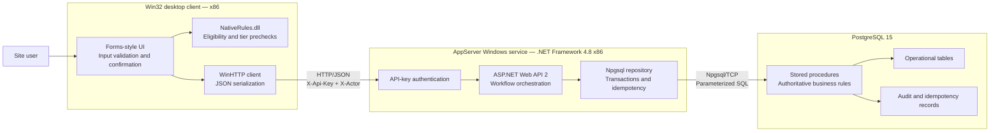
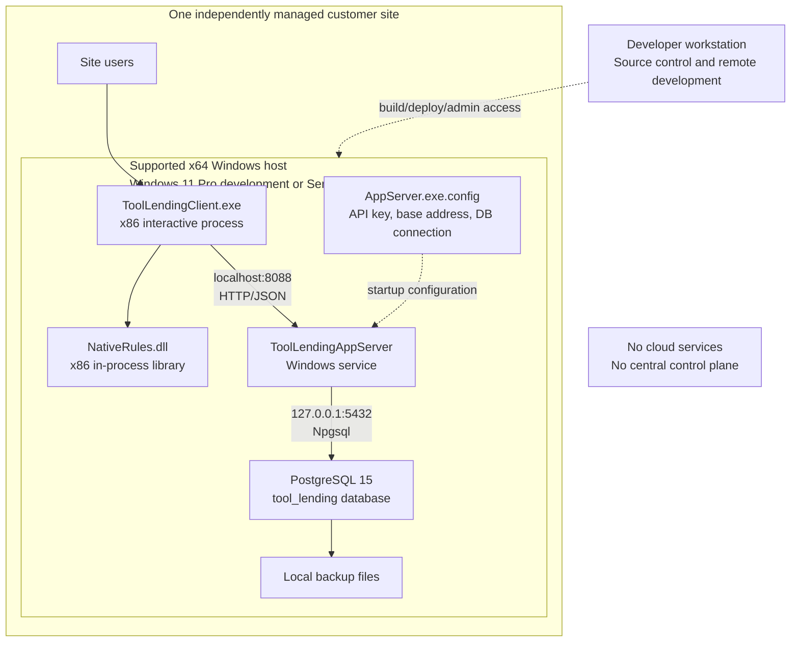
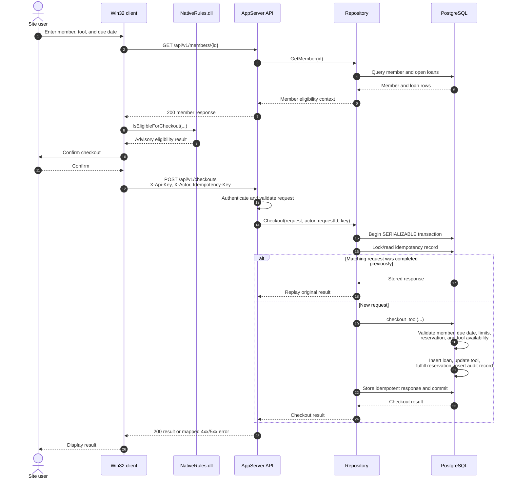
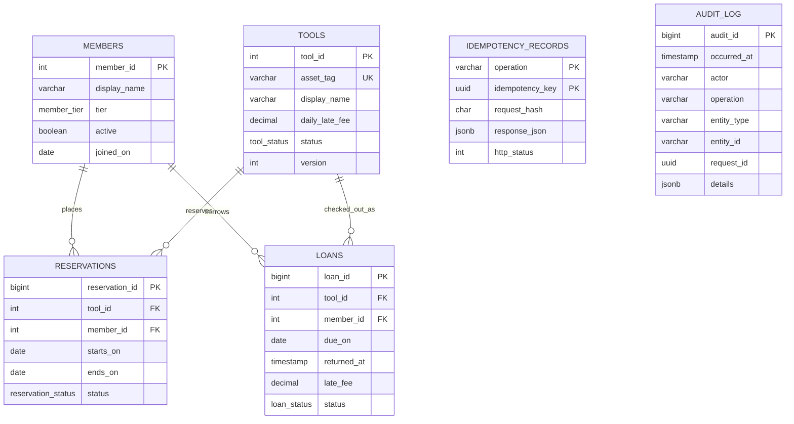
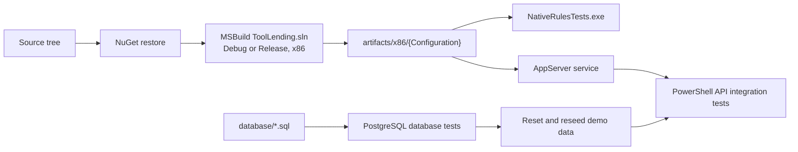

# Tool Lending Modernization Reference Application

This repository is a deliberately legacy-shaped, single-site client/server application used to demonstrate a staged modernization journey:

1. **Legacy** — the on-premises legacy baseline documented here.
2. **Connected** — the existing product connected to centralized services without replacing the core application.
3. **Hybrid** — selected capabilities moved to cloud services while local operation remains supported.
4. **SaaS** — a centrally operated, multi-tenant cloud product.

The application manages community-library tools, members, reservations, checkouts, returns, and late fees. It mirrors the architectural constraints described in the assessment without copying the domain or imaging features. It is an architecture demonstration, not a recommended greenfield design.

> **Current repository state:** this README describes the legacy baseline. The `main` branch preserves that baseline; modernization work begins on the `connected` branch.

## Architecture at a glance

The current system is a 32-bit Windows application deployed independently at each site. A native Win32 desktop client calls a local .NET Framework Windows service over HTTP. The service is the only application component allowed to connect to PostgreSQL. Critical rules are repeated in the database so they remain authoritative under concurrency.



### Technology stack

| Layer | Current technology | Runtime constraint |
|---|---|---|
| User interface | Native Win32 C++ | Windows, x86 |
| Client-side rules | Native C++ DLL | Windows, x86, loaded in-process |
| Client transport | WinHTTP and hand-built JSON | HTTP to `localhost:8088` by default |
| Application service | .NET Framework 4.8, ASP.NET Web API 2, OWIN | Windows service, x86 |
| Data access | Npgsql 4.1 | Service-only database access |
| Database | PostgreSQL 15 | One database per site |
| Build system | Visual Studio 2022 Build Tools, MSBuild, NuGet | Windows 11 Pro or Windows Server 2019 |
| Automation | Windows PowerShell 5.1 | Elevated shell required for service installation |

## Deployment and infrastructure

The reference deployment places every runtime component on one supported Windows host. Windows 11 Pro is supported for development and demonstrations; Windows Server 2019 represents the original deployment target. The desktop client can also represent a workstation on the same trusted local LAN, but there is no WAN-aware behavior, centralized control plane, cloud dependency, or multi-site coordination.



### Network and trust boundaries

| Boundary | Protocol | Authentication | Current expectation |
|---|---|---|---|
| User to desktop client | Local interactive session | Windows sign-in outside application scope | Trusted site user |
| Desktop client to service | HTTP/JSON | Static `X-Api-Key`; optional `X-Actor` audit identity | Loopback or trusted wired LAN |
| Service to database | PostgreSQL wire protocol | Database username and password | Loopback by default |
| Administrator to host | Windows administrative access | Environment-specific | Site-managed deployment |
| Site to cloud | None | None | Not implemented |

The seeded API key, `demo-local-key`, and default database password are intentionally non-secret development values. They must not be used outside an isolated demonstration environment. The current application does not provide TLS, end-user identity, tenant isolation, secret rotation, or zero-trust network controls.

## Component responsibilities

### Desktop client

`src/DesktopClient` contains the Win32 executable. Its Lending, Add user, and Add tool tabs validate
operator input, show generated record IDs, request confirmation, load member/tool information,
invoke native eligibility checks, and call the service with WinHTTP. It never connects directly to
PostgreSQL and never accepts operator-supplied database IDs for new records.

### Native rules library

`src/NativeRules` contains an x86 DLL that calculates tier checkout limits, maximum loan durations, and checkout eligibility. These checks provide immediate user feedback but are not authoritative; callers other than the desktop client could bypass them.

### Application service

`src/AppServer` contains a self-hosted Web API 2 application that can run interactively with `--console` or as the `ToolLendingAppServer` Windows service. It authenticates API calls, validates request models, supplies audit context, coordinates idempotent writes, maps expected database failures to HTTP responses, and owns all database access.

### Database

`database` contains bootstrap, schema, stored procedure, seed, reset, and test scripts. PostgreSQL owns concurrency-sensitive decisions and all durable state changes. Stored procedures lock applicable rows before checking availability and write business data and audit records in the same transaction.

## Business-rule ownership

Rules are intentionally distributed to reproduce a common legacy maintenance problem. Client and DLL checks improve usability; the database repeats critical checks under locks and is the final authority.

| Rule | Desktop UI | Native DLL | Service | PostgreSQL |
|---|---:|---:|---:|---:|
| Required fields and date shape | Primary | | DTO validation | |
| Tier checkout limit | Display | Precheck | Loads member state | **Authoritative** |
| Maximum loan duration | Display | Precheck | Pass-through | **Authoritative** |
| API authorization | | | **Authoritative** | |
| Idempotent writes | | | Coordinates and hashes request | Unique durable record |
| Tool availability and conflicts | Display only | | Error translation | **Authoritative with locks** |
| Overdue-member block | Warning | Precheck | Loads member status | **Authoritative** |
| Late-fee calculation | Displays result | | Orchestrates return | **Authoritative** |
| Audit trail | | | Supplies actor and request ID | **Authoritative insert** |

## Checkout request flow

A checkout illustrates the duplicated rules, security boundary, idempotency behavior, and transaction boundary.



## Data model



`idempotency_records` and `audit_log` are transaction-supporting records rather than parent/child entities, so they intentionally have no declared foreign keys to the operational tables.

## API surface

The service listens on `http://localhost:8088/` by default. Every endpoint requires `X-Api-Key`.

| Method | Route | Purpose |
|---|---|---|
| `GET` | `/api/v1/health` | Service and database health |
| `GET` | `/api/v1/tools` | List tools and current status |
| `POST` | `/api/v1/tools` | Create a tool with a database-generated ID |
| `GET` | `/api/v1/members/{id}` | Load member eligibility context |
| `POST` | `/api/v1/members` | Create a member with a database-generated ID |
| `POST` | `/api/v1/reservations` | Reserve a tool |
| `POST` | `/api/v1/checkouts` | Check out a tool |
| `GET` | `/api/v1/capabilities` | Read short-lived, service-owned Connected routing metadata |
| `POST` | `/api/v1/checkout-decisions` | Evaluate checkout eligibility without writing workflow data |
| `POST` | `/api/v1/returns` | Return a loan and calculate late fee |
| `GET` | `/api/v1/audit?take=100` | Read recent audit records |

Write endpoints also require a UUID in `Idempotency-Key`. Reusing the same key with the same payload replays the original result; reusing it with a different payload returns a conflict.

Expected database failures use stable `TLxxx` SQLSTATE codes. The API maps authentication failures to `401`, validation failures to `400`, missing records to `404`, business conflicts to `409`, and unexpected failures to `500` with a correlation/request ID.

The decision endpoint re-evaluates `connected.enabled` and the checkout child mode on every call.
It returns `409 CAPABILITY_STALE` when the supplied configuration version is stale or the current
server decision is Legacy. Completed decisions never write workflow, idempotency, or business-audit
records; PostgreSQL still makes the final decision when `/api/v1/checkouts` is called.

The desktop now parses its Legacy endpoint and optional Connected endpoint from external settings.
All product calls still use Legacy until the later capability router is implemented. Supported
process environment variables are:

| Variable | Default or rule |
|---|---|
| `TOOL_LENDING_LEGACY_BASE_URL` | `http://localhost:8088/` |
| `TOOL_LENDING_CONNECTED_BASE_URL` | Optional; must be an absolute `https://` URL |
| `TOOL_LENDING_CONNECTED_CREDENTIAL_FILE` | Required, readable, and non-empty when a Connected URL is configured |
| `TOOL_LENDING_RESOLVE_TIMEOUT_MS` | Default `5000`; range 100–60000 |
| `TOOL_LENDING_CONNECT_TIMEOUT_MS` | Default `5000`; range 100–60000 |
| `TOOL_LENDING_SEND_TIMEOUT_MS` | Default `10000`; range 100–120000 |
| `TOOL_LENDING_RECEIVE_TIMEOUT_MS` | Default `15000`; range 100–120000 |

WinHTTP retains Windows certificate-chain and hostname validation. The code provides no certificate
bypass. A keyed write may be replayed once after a timeout or unavailable result and always reuses
the exact same idempotency key. Missing or invalid Connected configuration fails closed at startup
and never falls back to the local demo credential.

## Build and run

Windows 11 Pro is the recommended development host, including when VS Code connects remotely from macOS. The API can run in console mode during development, so installing a Windows service is optional. See the [Windows 11 Pro and VS Code setup guide](docs/windows-11-pro-setup.md).

### Prerequisites

- Windows 11 Pro x64 or Windows Server 2019 with Desktop Experience
- .NET Framework 4.8 Developer Pack and runtime
- Visual Studio 2022 Build Tools with MSVC x86/x64 tools, Windows 10 SDK, and .NET Framework 4.8 targeting pack
- NuGet CLI 6.x
- PostgreSQL 15 x64 with command-line tools
- Windows PowerShell 5.1

Use the [Windows 11 Pro development guide](docs/windows-11-pro-setup.md) for VS Code development or the [Windows Server setup guide](docs/windows-server-2019-setup.md) for service deployment.

### Quick start

From PowerShell on the Windows host:

```powershell
Set-ExecutionPolicy -Scope Process Bypass
.\scripts\Setup-Prerequisites.ps1
.\scripts\Initialize-Database.ps1
.\scripts\Build.ps1
artifacts\x86\Release\AppServer.exe --console
```

Leave the API console open, then launch `artifacts\x86\Release\ToolLendingClient.exe` in a second terminal or through RDP. Run `scripts\Run-Tests.ps1` after the API is available. Installing the service remains available for deployment-like testing but requires an elevated shell. The seeded API key is `demo-local-key`; it is for the isolated local demo only.

### VS Code workflow on Windows 11 Pro

The repository includes recommended extensions, build/test tasks, and native debugger launch configurations in `.vscode`:

1. Run **Prerequisites: Check**.
2. Run **Database: Initialize** once.
3. Press `Ctrl+Shift+B` to build Debug x86.
4. Run **API: Run console (Debug)** and leave that terminal open.
5. Press `F5` and select **Debug Win32 client (x86)**.

Alternatively, launch a built client with a temporary Legacy credential file:

```powershell
.\scripts\Run-DesktopClient.ps1 -ApiKey 'demo-local-key' -Configuration Release
```

When VS Code is connected from macOS through Remote SSH, compilation and API execution occur on Windows. Use RDP to interact with the Win32 client window.

## Build and test flow



The test suite covers native rule calculations, database routines, API health and authentication, invalid request bodies and idempotency keys, reservation success and failure paths, idempotent checkout replay, inactive and overdue members, checkout limits, invalid due dates, reservation ownership, missing records, duplicate returns, late fees, audit creation, and competing concurrent checkouts.

## Code formatting

Repository formatting is controlled by `.editorconfig`, `.clang-format`, `.csharpierrc.json`, and
`PSScriptAnalyzerSettings.psd1`. Restore the repository-local .NET tools and format the supported
source and project files with:

```powershell
dotnet tool restore
.\scripts\Format-Code.ps1
```

Use `.\scripts\Format-Code.ps1 -Check` in CI or before committing. The script requires
`clang-format` 17 or newer, NuGet, and PowerShell 5.1; it restores CSharpier and
PSScriptAnalyzer automatically when necessary. SQL is kept in the same four-space,
statement-per-block style manually because the PostgreSQL routines contain PL/pgSQL and `psql`
metacommands that generic SQL formatters can alter incorrectly.

## Failure and recovery behavior

- Business writes use serializable database transactions; a failed operation leaves no partial business state.
- PostgreSQL row locks serialize competing reservations, checkouts, and returns for the same records.
- Idempotency records make service restarts and client retries safe for completed write requests.
- Windows service recovery attempts two automatic process restarts. This is process recovery, not high availability.
- Database backup is script-driven and site-operated; off-host retention is not built into the application.
- There is no failover node, replicated database, disaster-recovery orchestration, offline client queue, or cross-site recovery.

## Current architectural constraints

These constraints form the baseline against which Connected, Hybrid, and SaaS changes should be measured:

- One independently installed service and database per site.
- x86 coupling across the desktop client, native DLL, and service.
- Windows-only build, deployment, and operations.
- Business behavior distributed across UI, DLL, service, and stored procedures.
- Static application-level API key rather than user/device identity.
- Optional SMB-hosted credential file shared by every Legacy desktop client in a practice.
- Configuration and database credentials stored beside the service executable.
- No central tenant, fleet, release, telemetry, or policy management.
- No WAN resilience, cloud control plane, multi-tenancy, automated elasticity, or managed high availability.
- Site-specific backup, patching, monitoring, deployment, and incident response.

## Repository map

```text
.
├── src/
│   ├── DesktopClient/       # x86 Win32 user interface and HTTP client
│   ├── NativeRules/         # x86 native business-rule DLL
│   └── AppServer/           # .NET Framework Windows service and Web API
├── database/                # schema, routines, seed, reset, and SQL tests
├── tests/
│   ├── NativeRulesTests/    # native C++ unit executable
│   └── Integration/         # API integration tests
├── scripts/                 # setup, build, install, backup, reset, and test automation
├── docs/                    # focused architecture, setup, and demonstration guides
└── ToolLending.sln          # Visual Studio x86 solution
```

Additional documentation:

- [Architecture and rule ownership](docs/architecture.md)
- [Legacy shared credential model](docs/legacy-shared-credential.md)
- [Windows 11 Pro development with VS Code](docs/windows-11-pro-setup.md)
- [Windows Server 2019 setup and operations](docs/windows-server-2019-setup.md)
- [Demonstration script](docs/demo.md)

## Documentation expectations for modernization stages

The test baseline and promotion gates for the Legacy, Connected, Hybrid, and SaaS stages are
documented in [`docs/testing-evolution.md`](docs/testing-evolution.md).

Each future stage should update this README or link to a versioned architecture decision record that identifies:

- the stage objective and explicit non-goals;
- changed components and retained legacy dependencies;
- logical, deployment, network, identity, and data-flow diagrams;
- rule and data ownership changes;
- security and tenant boundaries;
- connectivity, offline, failure, retry, and rollback behavior;
- observability, deployment, support, backup, and disaster-recovery ownership;
- migration/coexistence strategy from the preceding stage; and
- measurable improvements and newly introduced trade-offs.
