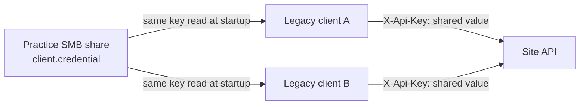

# Legacy shared credential model

The Legacy desktop client can model the shared-credential and SMB exposure identified in the
reference case study. This is a characterization of a migration liability, not a recommended
authentication design.

## Behavior

At startup, each desktop client reads the same practice-level API key from the file named by
`TOOL_LENDING_LEGACY_CREDENTIAL_FILE`. The path may be a UNC path on an existing SMB share or a
local path used for development and automated tests. The key is sent to the local API as
`X-Api-Key`, while `X-Actor: legacy.desktop` continues to identify the calling application rather
than a human user.



The UI displays the credential file path so the Legacy trust model is visible during demos, but it
never displays the credential value. If a path is configured but the file is missing, unreadable,
or empty, the client shows `Legacy credential error` and exits. If the variable is absent, the
existing `demo-local-key` fallback keeps the local proof of concept compatible.

## Development setup

Copy the example outside source control and give it the same value as the API's `ApiKey` setting:

```powershell
$directory = 'C:\ProgramData\ToolLending\LegacyShare'
New-Item -ItemType Directory -Path $directory -Force | Out-Null
Copy-Item .\config\legacy-client.credential.example "$directory\client.credential"
$env:TOOL_LENDING_LEGACY_CREDENTIAL_FILE = "$directory\client.credential"
```

To characterize an existing practice share, set the variable to a UNC path such as
`\\practice-server\EaglesoftShared\client.credential`. This repository does not create an SMB
share, open firewall port 445, or contain a real credential.

## Security boundary and retirement

The file authenticates the practice/client population, not an individual. Anyone who can read it
can impersonate any Legacy client, rotation affects every workstation, and file availability is a
startup dependency. Access must therefore be limited with SMB and NTFS permissions even in the
Legacy baseline.

Connected must externalize the credential and protect transport. Hybrid must distinguish old and
new callers while both paths coexist. SaaS must replace this practice-shared secret with individual
or device identity and authorization. Scenario `SEC-002` in the testing baseline tracks that
retirement.
