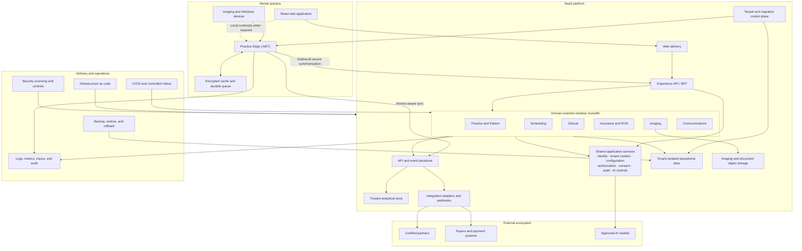
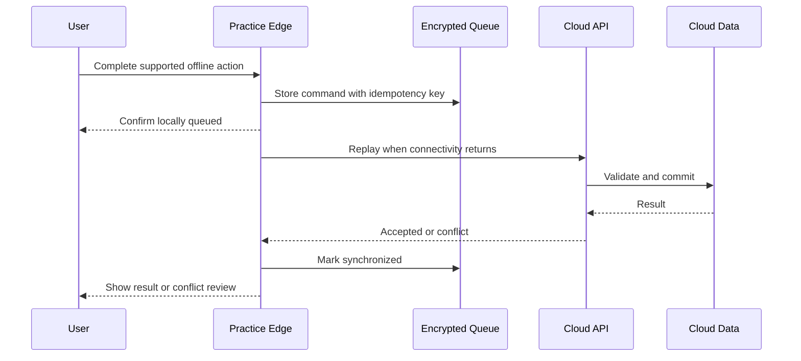
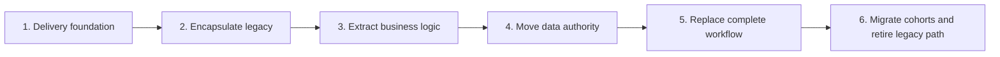

# Eaglesoft POC North Star Architecture

**Status:** Living architecture direction  
**Last updated:** 2026-08-26  
**Applies to:** Legacy -> Connected -> Hybrid -> SaaS POC evolution

## Purpose

This document defines the architectural destination for the POC. It is the reference point for evaluating design decisions as the application evolves from Legacy through Connected and Hybrid to SaaS.

The destination should remain clear, but this document is intentionally expected to change as the POC produces evidence. Material changes should record what changed, why it changed, and what evidence supported the decision.

## Source material

This North Star synthesizes:

- `Eaglesoft_Three-Year_Technology_Strategy_Mark_Cooper_v1.57_CONFIDENTIAL_RECIPIENT_COPY.pptx`
- `eaglesoft-roadmap-case-study.pptx`

The source decks inform the direction; they are not executable specifications. Technology choices marked as hypotheses must be validated through representative workflows, operational testing, migration rehearsals, and customer evidence.

## North Star statement

> Eaglesoft becomes a tenant-aware SaaS product built around a React experience, an Experience API, and a domain-oriented .NET modular monolith. Cloud modules own migrated workflows and their authoritative data. A narrowly bounded .NET Practice Edge preserves essential offline operation and Windows-device access through encrypted, version-aware synchronization. Governed APIs, reliable events, shared identity, audit, analytics, and operational controls support the wider ecosystem. Legacy components decline workflow by workflow and are retired only after data, reliability, adoption, and recovery evidence passes agreed gates.

Hybrid is a controlled transition state. The Practice Edge is a deliberate, bounded component of the final SaaS product.

## Target architecture



## Durable architecture decisions

These decisions define the intended destination:

1. SaaS is the primary destination.
2. Each data element has one authoritative owner at any moment.
3. Modules communicate through defined APIs and events rather than shared implementation details.
4. Local continuity and device support are bounded within the Practice Edge.
5. Security, audit, observability, and authorization are tenant-aware.
6. The cloud application begins as a modular monolith; modules become independent services only when evidence justifies the operational cost.
7. Workflows and their system-of-record data move together.
8. Legacy paths are retired only after migration and operational gates pass.

## Product architecture

### React application shell

The browser experience maintains patient and practice context, loads complete workflow modules, and adapts navigation and behavior by role. During transition it presents cloud and supported local capabilities as one coherent product.

The application shell communicates through the Experience API and does not access domain databases directly.

### Experience API / BFF

The BFF:

- Returns UI-ready representations.
- Composes results from domain modules.
- Carries identity, tenant, authorization, and correlation context.
- Insulates the UI from internal module and migration changes.
- Provides a stable boundary while workflows have different systems of record.

### Domain-oriented modular monolith

The initial cloud backend is a single deployable .NET application with explicit domain modules. Each module owns its rules, data, contracts, commands, events, authorization decisions, and tests.

Modules must not query another module's private tables directly. They collaborate through defined module interfaces or events. A module should become an independently deployed service only when scale, resilience, ownership, or release independence provides a measurable advantage.

## Data architecture

### One authoritative owner

Dual-write authority is prohibited. Authority moves through an explicit sequence:

```text
Legacy authoritative
    -> copy and reconcile cloud data
    -> switch every write for the workflow to cloud
    -> maintain legacy projection only where temporarily required
    -> retire the legacy path
```

### Tenant isolation

The target supports strong practice-level isolation, independent migration and restoration, tenant-aware authorization, centralized schema management, and consistent identifiers.

Database-per-practice is the current isolation direction from the roadmap case study. The exact physical topology remains evidence-based and must be evaluated against cost, scale, recovery, operational complexity, and regulatory requirements.

### Analytics and AI

Reliable domain events populate trusted analytical datasets. Analytics and AI do not query operational practice databases directly.

The analytical platform requires common metrics, lineage, source traceability, tenant isolation, data-quality verification, authorized datasets, and audited access. Consequential AI actions require approved models, approved actions, appropriate human review, and recorded outcomes.

## Practice Edge

The Practice Edge is the bounded local component responsible for:

- Essential offline workflows.
- Encrypted local cache.
- Durable outbound command queue.
- Idempotent replay.
- Version-aware synchronization.
- Conflict detection and review.
- Imaging and Windows-device adapters.
- Secure outbound-only cloud communication.
- Health and version reporting.

It must not become a second complete Eaglesoft implementation or a permanent independent system of record.



## Shared platform capabilities

Shared capabilities include:

- Identity and access.
- Tenant context.
- Authorization.
- Consent and permitted use.
- Configuration and feature flags.
- Audit.
- API and event contracts.
- Observability and source traceability.
- AI access and controls.

Service-to-service communication uses managed workload identity rather than embedded or shared credentials.

## Integration architecture

Direct database integrations are replaced by versioned APIs, reliable events, webhooks, standards-based adapters, scoped partner credentials, consent enforcement, and contract testing.

A developer portal, integration sandbox, partner certification, and metering can be added when validated ecosystem demand exists. They are not prerequisites for migrating the first workflows.

## Delivery and operational architecture

The product architecture includes:

- Automated regression and security testing.
- Repeatable test environments.
- Infrastructure as code.
- Automated deployment and rollback.
- Feature flags and controlled customer cohorts.
- Service-level objectives and distributed telemetry.
- Backup, restore, and recovery validation.
- Practice migration rehearsal and data reconciliation.
- Support diagnostics.

Every vertical workflow slice passes the same gates:



Rollout expands only when applicable data-integrity, workflow, offline, reliability, recovery, support, adoption, retention, predictability, and cost gates pass.

## Technology hypotheses

These are pragmatic defaults to test rather than durable commitments:

| Capability | Current default |
| --- | --- |
| Transactional application | .NET / C# |
| Web experience | TypeScript and React |
| Practice Edge | .NET first; Go only for a measurable benefit |
| Operational data | PostgreSQL hypothesis |
| Analytics and AI | Python |
| Runtime | Linux containers and managed services |
| Cloud | Azure or AWS selected through evidence |
| Infrastructure dependencies | Hidden behind portable contracts where practical |

Cloud neutrality means avoiding unnecessary platform coupling. It does not mean operating multiple clouds simultaneously.

## Explicit non-goals

The POC should not steer toward:

- A big-bang rewrite or forced migration.
- Hosting every legacy installation in a virtual machine as the destination.
- Permanent dual data authority.
- Permanent broad hybrid functionality.
- Microservices, Kubernetes, cells, or multi-cloud by default.
- Modernizing every layer and domain simultaneously.
- Waiting for complete feature parity before customer adoption.
- Direct partner access to operational databases.
- A speculative data lake, platform, or marketplace.
- Rebuilding the entire desktop product inside the Practice Edge.

## Applying the North Star to the POC

Each POC change should answer:

1. Which stage does it demonstrate: Legacy, Connected, Hybrid, or SaaS?
2. Which durable architecture decision does it advance or test?
3. Who owns the affected data before and after the change?
4. What contract separates the old implementation from the new one?
5. How will behavior, data integrity, offline operation, security, and recovery be tested?
6. What evidence permits expansion to another workflow or customer cohort?
7. Which legacy path can eventually be retired because of this work?

## Decision log

Record material refinements here so that the North Star evolves transparently.

| Date | Decision | Evidence and rationale |
| --- | --- | --- |
| 2026-08-26 | Adopted the initial North Star architecture. | Synthesized the three-year strategy and roadmap case study into a SaaS destination with a domain-oriented modular monolith and bounded Practice Edge. |

