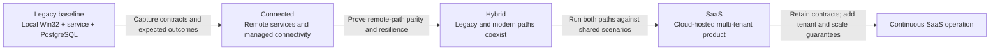

# Testing baseline and modernization gates

This document defines how tests protect behavior while the application evolves through the
**Legacy**, **Connected**, **Hybrid**, and **SaaS** stages. The current Legacy implementation is
the behavioral baseline. Later implementations may change technology, deployment, and user
experience, but they must not unintentionally change the business outcomes captured here.

The goal is not to preserve every implementation detail. It is to preserve observable contracts:
business decisions, API behavior, data integrity, auditability, and critical user workflows.

## Baseline strategy



Every stage inherits the previous stage's tests unless a test is deliberately replaced. A test may
be replaced only when the old implementation boundary no longer exists and an equivalent test
protects the same contract at the new boundary. The replacement and its rationale must be recorded
in this document.

## Test layers

| Layer | Current implementation | Protects | Execution environment |
|---|---|---|---|
| Native rule tests | `tests/NativeRulesTests/main.cpp` | Tier limits, loan duration, and checkout eligibility decisions | Any configured Windows build session |
| Database tests | `database/901_database_tests.sql` | Authoritative PostgreSQL rules and stable `TLxxx` errors | Windows host with the test database |
| API integration tests | `tests/Integration/ApiTests.ps1` | HTTP contracts, authorization, validation, workflows, idempotency, audit, and concurrency | Windows host with API and PostgreSQL running |
| Desktop UI tests | `tests/DesktopClient.UiTests` | Win32 automation contract and critical user-visible validation | Interactive, unlocked Windows desktop |

The layers intentionally overlap. For example, an overdue member is rejected by the native
precheck for immediate feedback, by the API integration path as an externally visible contract,
and by PostgreSQL as the authoritative concurrency-safe rule. That overlap proves defense in depth;
it is not redundant implementation testing.

## Current Legacy baseline

### Native business rules

The native test executable currently verifies:

- `STANDARD` members have a checkout limit of 2.
- `SUPPORTER` members have a checkout limit of 5.
- `STAFF` members have a maximum loan duration of 30 days.
- An active `STANDARD` member below the limit and without overdue loans is eligible.
- A member with an overdue loan is ineligible.
- A member at the tier checkout limit is ineligible.
- An inactive member is ineligible.

These tests characterize the behavior of `NativeRules.dll`. During Connected and Hybrid stages,
they remain the baseline for any rule code still shipped to the desktop. Before the native library
is retired, equivalent service-level tests must demonstrate the same decision table.

### Database rules

The current database test transaction verifies:

- Tier checkout limits and maximum-loan-day rules return expected values.
- A tool in maintenance cannot be checked out and produces `TL003`.
- A member with an overdue loan cannot check out another tool and produces `TL005`.
- The test rolls back so it does not leave business data behind.

This suite is intentionally small today. It should expand around every stored routine that owns
authoritative state transitions, particularly locking, idempotency, reservation conflicts, returns,
fees, and audit writes.

### API contracts and workflows

The API integration suite currently verifies:

| Area | Covered behavior |
|---|---|
| Health and reads | Healthy database connection, seeded tools, borrowed-tool details, member tier, and outstanding loans |
| Request validation | Null checkout and reservation bodies, invalid model values, invalid return IDs, and malformed idempotency keys |
| Record creation | Member and tool success, generated IDs, idempotent replay, invalid models, duplicate asset tags, reads, and audit entries |
| Reservations | Success; invalid dates; inactive member; maintenance or already-reserved tool; missing tool or member |
| Checkouts | Success; replay with the same idempotency key; inactive member; maintenance tool; overdue member; invalid due date; reservation owned by another member; missing tool or member; checkout limit |
| Returns | Success, positive late fee, duplicate return, and missing loan |
| Audit | Successful reservation, checkout, and return operations create audit entries |
| Concurrency | Two callers competing for one reserved tool produce exactly one success and one conflict |
| Authentication | A request without the API key is rejected with HTTP 401 |

Expected client and business failures are part of the contract. Validation failures return HTTP
400, authentication failures return 401, missing records return 404, and business conflicts return
409 with stable `TLxxx` codes where applicable. Unexpected failures return 500 with a request ID.

### Win32 desktop UI

The FlaUI/NUnit suite currently verifies:

- Member, tool, due-date, loan, checkout, refresh, and return controls expose stable Automation IDs.
- Attempting checkout without a member displays the expected `Validation` message.
- A configured shared credential file is identified in the UI without exposing its secret value.
- Add user and Add tool tabs expose stable controls and state that IDs are assigned automatically.
- Missing required user input produces an actionable validation message.

The UI runner creates a temporary local credential file to model the SMB-backed Legacy behavior
without creating a network share or using a real secret. The client must fail closed when an
explicitly configured credential file cannot be read or is empty. The built-in demo fallback is
retained only for the unconfigured local proof-of-concept path.

This is the beginning of the UI characterization suite. Add tests for positive IDs, due-date shape,
confirmation and cancellation, API errors, successful checkout, tool refresh, returns, keyboard
navigation, and accessible names before changing the corresponding UI behavior.

UI tests validate wiring and user-visible behavior. Business-rule permutations belong primarily in
native, service, or API tests, where they run faster and identify failures more precisely.

## How to run the baseline

### Build

From PowerShell on the Windows development host:

```powershell
Set-ExecutionPolicy -Scope Process -ExecutionPolicy Bypass -Force
cd C:\src\win32_migration_poc
.\scripts\Build.ps1 -Configuration Release
```

The build script restores the legacy `packages.config` dependencies with NuGet, builds the x86
legacy solution with Visual Studio Build Tools, and builds the .NET 8 FlaUI project with `dotnet`.

### Native, database, and API suites

Start the Release API in console mode from one terminal:

```powershell
.\artifacts\x86\Release\AppServer.exe --console
```

Run the non-UI suites from a second terminal:

```powershell
.\scripts\Run-Tests.ps1 -Configuration Release
```

The integration suite resets the database to deterministic demo data. Do not point it at an
environment containing data that must be retained.

### Desktop UI suite

Run UI tests inside an active, unlocked RDP or local Windows session:

```powershell
.\scripts\Run-UiTests.ps1 -Configuration Release
```

FlaUI requires access to the interactive Windows desktop. An SSH session, Windows service, or
locked/disconnected desktop is not a valid UI-test environment.

## Evolution by stage

### Legacy gate

Purpose: characterize the existing application before moving responsibilities.

Required evidence:

- A clean Release build.
- All native, database, and API integration tests pass.
- All available UI tests pass in the supported Windows environment.
- Seed/reset scripts produce repeatable results.
- Known warnings and intentionally uncovered behavior are documented.

No modernization change should begin with a red baseline. If an existing defect must remain for
compatibility, capture it with a characterization test and label it as known behavior.

### Connected gate

Purpose: prove the desktop can use remotely hosted services without changing business outcomes.

Retain all Legacy suites and add:

- Contract tests that run against both local and connected API endpoints.
- TLS certificate, hostname, and authentication tests.
- Network timeout, retry, unavailable-service, and interrupted-request scenarios.
- Idempotent retry tests across real network failures.
- Configuration tests proving secrets and endpoint addresses are externalized.
- Tests proving the practice-shared Legacy credential can be retired without silently falling back.
- UI tests proving connected failures are understandable and do not corrupt local state.
- Client harness checks proving service mode bypasses NativeRules and member policy fields, accepts
  only the versioned service reason table, and maps every stable denial to safe operator text.
- Performance baselines for representative read and write operations over the network.

Promotion criterion: the same input dataset and workflow matrix produce equivalent API outcomes,
database state, and audit records in Legacy-local and Connected environments.

### Hybrid gate

Purpose: prove old and new implementations can coexist safely during incremental migration.

Retain applicable Legacy and Connected suites and add:

- A shared, implementation-neutral contract suite executed against both paths.
- Golden scenario datasets with normalized result comparison.
- Routing and feature-flag tests for selecting the legacy or modern implementation.
- Dual-read comparison tests where both systems return the same logical result.
- Dual-write or change-propagation tests, if used, including replay and partial-failure recovery.
- Backward- and forward-compatible schema tests.
- Reconciliation tests for data divergence and repair.
- Rollback tests proving traffic can return to the legacy path without data loss.
- Version-skew tests covering supported old-client/new-service combinations.

Promotion criterion: every migrated capability passes its contract suite through both paths, and
reconciliation reports no unexplained differences. A capability is not removed from the legacy path
until rollback, audit, and data ownership are explicit.

### SaaS gate

Purpose: preserve functional parity while adding multi-tenancy, scale, security, and continuous
operations.

Retain implementation-neutral business and API contracts and add:

- Tenant-isolation tests for reads, writes, caches, queues, exports, logs, and audit records.
- Identity and role-based authorization tests; the demo API key must be retired.
- Provisioning, migration, suspension, deletion, and data-retention lifecycle tests.
- Public API compatibility, pagination, throttling, and versioning tests.
- Load, soak, capacity, and noisy-neighbor tests using documented service objectives.
- Regional failure, dependency outage, retry, backup, and disaster-recovery exercises.
- Observability tests for correlation IDs, metrics, alerts, traces, and audit completeness.
- Web UI tests for critical journeys, with accessibility validation against the chosen standard.
- Security testing for dependencies, secrets, configuration, common web threats, and supply chain.

Promotion criterion: functional contracts pass per tenant, isolation tests show no cross-tenant
access, recovery objectives are demonstrated, and service-level indicators meet their agreed
thresholds under representative load.

## Cross-stage scenario matrix

Use one logical scenario catalog across all stages. Each scenario receives a stable ID so results
can be compared even when its implementation moves between DLL, service, database, and cloud
components.

| Scenario ID | Scenario | Current coverage | Connected | Hybrid | SaaS |
|---|---|---|---|---|---|
| `MEM-001` | Inactive member cannot borrow | Native + API | Same API contract over TLS | Both paths | Per-tenant API contract |
| `LOAN-001` | Eligible member checks out available tool | Native + API | Connected success and retry | Both paths + reconciliation | Authenticated tenant workflow |
| `LOAN-002` | Checkout limit enforced | Native + API | Same `TL006` outcome | Both paths | Tenant-configured limit contract |
| `LOAN-003` | Overdue member blocked | Native + DB + API | Same `TL005` outcome | Both paths | Service-owned rule contract |
| `LOAN-004` | Competing checkout has one winner | API concurrency | Networked concurrency | Cross-path concurrency | Distributed concurrency/load |
| `RES-001` | Reservation succeeds | API | Connected contract | Both paths | Tenant workflow |
| `RES-002` | Reservation conflict rejected | API | Connected contract | Both paths | Distributed conflict contract |
| `RET-001` | Return calculates late fee | API | Connected contract | Both paths | Tenant and currency policy contract |
| `RET-002` | Duplicate return rejected | API | Retry across network loss | Both paths | Distributed idempotency contract |
| `SEC-001` | Unauthenticated request rejected | API | TLS + credential contract | Both paths | Identity/RBAC contract |
| `SEC-002` | Shared credential source visible without exposing its value | FlaUI + configuration | Externalized secret; no fallback | Legacy and new identities coexist explicitly | Practice-shared credential removed |
| `UI-001` | Required checkout fields validated | FlaUI | Connected Win32 client | Legacy and new UI paths | Web UI equivalent |
| `ADM-001` | Member creation assigns an ID and is idempotent | API + FlaUI wiring | Connected contract | Both paths | Tenant-scoped identity |
| `ADM-002` | Tool creation assigns an ID and rejects duplicate asset tags | API + FlaUI wiring | Connected contract | Both paths | Tenant-scoped inventory identity |

Expand this matrix whenever a rule, workflow, or failure mode is discovered. A modernization pull
request that moves a responsibility should reference the affected scenario IDs.

## Test data and repeatability

- Treat `database/003_seed.sql` and `database/900_reset.sql` as versioned test fixtures.
- Keep test clocks explicit. Derive relative dates from a captured test date or inject a clock when
  rules become time-zone or tenant aware.
- Generate a new idempotency key for a new operation; reuse it only to simulate a retry.
- Never use production credentials or production data in automated suites.
- Make concurrent tests assert outcomes, not execution order.
- Reset state before scenarios that depend on exact loan or reservation counts.

Connected, Hybrid, and SaaS environments should provision isolated test tenants or databases from
the same logical fixture version. Record the fixture version with every test result.

## Evidence and release decisions

For each candidate build, retain:

- Source commit and branch.
- Build configuration and dependency versions.
- Operating-system and database versions.
- Test environment and fixture version.
- Per-suite pass, failure, and skip counts.
- Failure logs and request/correlation IDs.
- Performance measurements when a stage has performance gates.
- An explicit disposition for every skipped or quarantined test.

A green result means all mandatory tests passed; it does not mean skipped tests were ignored. A
test may be quarantined only with an owner, documented reason, linked issue, and expiration date.

## Maintaining this document

Update this baseline whenever:

- A business rule or public error contract changes.
- A test suite or execution command changes.
- Responsibility moves between client, service, database, or cloud components.
- A stage introduces a new trust boundary, data owner, or failure mode.
- A Legacy test is replaced by a technology-neutral equivalent.

Link to the exact executable tests instead of duplicating their implementation here. This document
describes intent, coverage, and promotion criteria; the repository remains the source of truth for
the assertions themselves.
